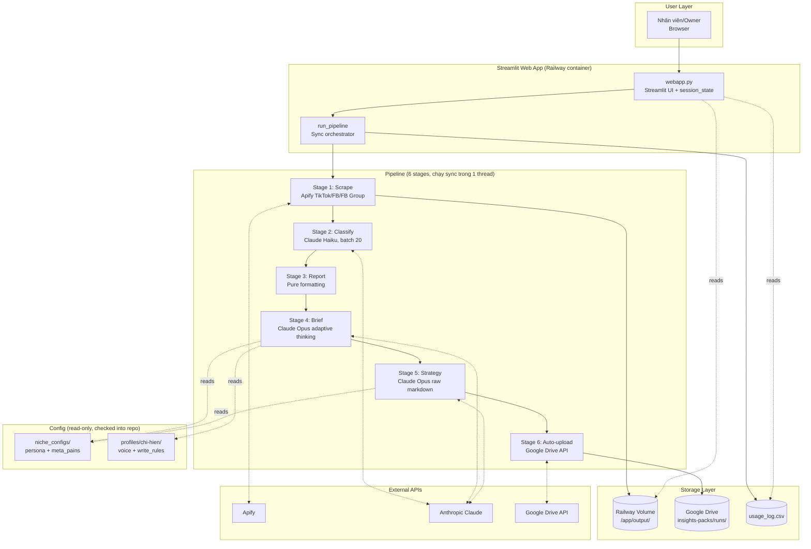

# TikTok Insight Miner — Architecture & Optimization Guide

> **Phiên bản**: v1.0 (2026-06-25)
> **Mục đích**: cho kỹ sư mới nhận vị trí **tối ưu app** — hiểu kiến trúc, biết chỗ nào bottleneck, chỗ nào tech debt, chỗ nào ROI cao nhất để refactor.
> **Đối tượng**: senior/mid backend engineer, đọc code Python thoải mái.
> **Thời gian đọc**: 45-60 phút (đọc kỹ Section 2-5 + 10 là đủ để bắt đầu).
> **KHÔNG cần đọc**: Section 12+ (deployment lich sử) trừ khi phải chạm infra.

---

## Mục lục

1. [Executive summary](#1-executive-summary)
2. [Sơ đồ kiến trúc tổng thể](#2-sơ-đồ-kiến-trúc-tổng-thể)
3. [Pipeline 6 stages](#3-pipeline-6-stages-chi-tiết)
4. [Code structure — modules](#4-code-structure--modules)
5. [Data flow chi tiết](#5-data-flow-chi-tiết)
6. [Storage layers (3 tier)](#6-storage-layers-3-tier)
7. [Config-driven design](#7-config-driven-design)
8. [State management (Streamlit session)](#8-state-management-streamlit-session)
9. [External dependencies](#9-external-dependencies)
10. [**Known technical debt + bottlenecks**](#10-known-technical-debt--bottlenecks) ⭐
11. [**Optimization opportunities theo ROI**](#11-optimization-opportunities-theo-roi) ⭐
12. [Deployment (Railway)](#12-deployment-railway)
13. [Testing status](#13-testing-status)
14. [Historical bug patterns](#14-historical-bug-patterns-tránh-lặp-lại)

---

## 1. Executive summary

### App là gì

**Streamlit web app** chạy pipeline 6 stages để chuyển comment audience (TikTok / Facebook / Facebook Group / paste manual) → content brief có chiều sâu psychology.

Users: 1 owner (Tuấn) + 1 coach (Hiền) + 3-5 nhân viên.

### Tech stack

| Layer | Tech | Note |
|---|---|---|
| UI | **Streamlit** (Python) | Single-page app, session-based state |
| Language | **Python 3.11+** | match/case, PEP 604 union types |
| LLM | **Anthropic SDK** (Claude) | Opus 4.7 cho brief + strategy, Haiku 4.5 cho classify |
| Scraper | **Apify Python client** | TikTok + FB post + FB Group |
| Data validation | **Pydantic v2** | Comment, ContentAngle schemas |
| Storage | **Filesystem** (Railway Volume) + **Google Drive** (backup) | KHÔNG có database |
| Hosting | **Railway** (PaaS) | Docker deploy from GitHub main |
| Config | **JSON + Markdown files** | niche_configs/ + profiles/ |

### Quy mô hiện tại

- **~30 pipeline runs/tháng** (theo `usage_log.csv`)
- **~500KB-2MB output per run** (Volume tổng ~50MB)
- **1 niche production** (`kinh-doanh-27-45`) + vài niche test
- **Cost API**: $5-30/tháng Anthropic + $2-10 Apify
- **Cost hosting**: $5-15/tháng Railway

### Vì sao cần tối ưu

Xem [Section 10 — Tech debt](#10-known-technical-debt--bottlenecks) và [Section 11 — Optimization opportunities](#11-optimization-opportunities-theo-roi).

**Tóm tắt**: app work nhưng có **7 tech debt lớn** đang cản anh scale lên 20+ users hoặc thêm niche mới.

---

## 2. Sơ đồ kiến trúc tổng thể



### ASCII fallback nếu không render Mermaid

```
┌─────────────┐     ┌──────────────────┐     ┌─────────────────┐
│  Browser    │────▶│  Streamlit UI    │────▶│  run_pipeline() │
│  (users)    │◀────│  session_state   │◀────│  sync sequential│
└─────────────┘     └──────────────────┘     └────────┬────────┘
                                                      │
                    ┌─────────────────────────────────┼──────────────────────┐
                    ▼                                 ▼                      ▼
            ┌──────────────┐              ┌──────────────────┐    ┌──────────────┐
            │  Apify API   │              │  Anthropic API   │    │  Drive API   │
            │  (scrape)    │              │  (classify/brief │    │  (upload)    │
            └──────────────┘              │   /strategy)     │    └──────────────┘
                    │                     └────────┬─────────┘             │
                    ▼                              ▼                       ▼
            ┌────────────────────────────────────────────────────────────────┐
            │  /app/output/<niche>/<date>/<user>/                            │
            │    ├── raw_comments.json      ← Stage 1                        │
            │    ├── classified.json         ← Stage 2                        │
            │    ├── report.md               ← Stage 3                        │
            │    ├── brief.md + brief.json   ← Stage 4                        │
            │    ├── phan-tich-toan-dien.md  ← Stage 5                        │
            │    └── cowork-brief-pack_*.md  ← Optional (Stage C)             │
            └────────────────────────────────────────────────────────────────┘
```

---

## 3. Pipeline 6 stages chi tiết

### Stage 1 — Scrape (multiple sources)

| Field | Value |
|---|---|
| Module | [tiktok_insight_miner/scraper.py](../tiktok_insight_miner/scraper.py) |
| Functions | `scrape_tiktok_comments()`, `scrape_facebook_comments()`, `scrape_facebook_group_comments()` |
| SDK | `apify-client` (Python) — v2+ trả về Pydantic `Run` object (không phải dict — bug đã fix qua `_extract_dataset_id()` helper) |
| Input | List URLs (TikTok / FB post / FB Group) HOẶC paste text (manual mode, no scrape) |
| Output | `raw_comments.json` (list of Comment dict) |
| Blocking | ✅ Yes (sync, đợi Apify actor xong) |
| Latency | 30-90s tuỳ platform |
| Failure mode | RuntimeError nếu Apify fail hoặc trả 0 comments |

**Actors dùng**:
| Actor | Cost | Use case |
|---|---|---|
| `clockworks/tiktok-comments-scraper` | $0.001/cmt | TikTok video |
| `apify/facebook-comments-scraper` | $0.0014/cmt | FB post (Fanpage / user public) |
| `apify/facebook-groups-scraper` | $0.005/post | FB Group public — trả top comments/post |

**Chỗ tối ưu** (xem Section 11):
- Parallel scraping nhiều URLs (hiện tại Apify tự handle nhưng chưa expose control)
- Cache theo URL để tránh scrape lại

### Stage 2 — Classify (Claude Haiku)

| Field | Value |
|---|---|
| Module | [tiktok_insight_miner/classifier.py](../tiktok_insight_miner/classifier.py) |
| Function | `classify_comments()` |
| Model | `claude-haiku-4-5` (default) |
| Method | `client.messages.parse()` với Pydantic `BatchClassificationResult` |
| Batch size | 20 comments/API call (configurable qua `CLASSIFY_BATCH_SIZE` env) |
| Cache | ✅ Prompt caching qua `cache_control: {"type": "ephemeral"}` cho system prompt |
| Blocking | ✅ Yes (sequential batches) |
| Latency | ~10s/batch × N batches |
| Failure handling | Fail-fast on `AuthenticationError`; 3 batches liên tiếp fail → raise |

**Output**: `classified.json` — mỗi comment có `bucket` (7 loại: pain/desire/question/objection/praise/mention/other) + `summary` + `confidence`.

**Chỗ tối ưu**:
- ⚠️ Sequential batches — có thể parallel với `asyncio` để giảm latency 5x
- Cache hit rate: check `usage.cache_read_input_tokens` (đã log)

### Stage 3 — Report (pure formatting)

| Field | Value |
|---|---|
| Module | [tiktok_insight_miner/reporter.py](../tiktok_insight_miner/reporter.py) |
| Function | `generate_report()` |
| Method | Python string formatting (không LLM) |
| Output | `report.md` — distribution table + top 10 quotes per bucket + common themes |
| Latency | <5s (không blocking) |
| Cost | $0 |

**Chỗ tối ưu**: gần như không có (đã tối ưu).

### Stage 4 — Brief (Claude Opus, cốt lõi của app)

| Field | Value |
|---|---|
| Module | [tiktok_insight_miner/suggester.py](../tiktok_insight_miner/suggester.py) |
| Function | `generate_brief()` |
| Model | `claude-opus-4-7` (default, có thể override qua `SUGGESTER_MODEL`) |
| Method | `client.messages.parse()` với Pydantic `ContentAngleBrief` (structured output) |
| Thinking | Adaptive (auto-enabled qua `startswith("claude-opus-4")` check) |
| System prompt | ~1600 tokens (framework v1.1) + persona injection nếu có |
| Blocking | ✅ Yes (single API call, không stream) |
| Latency | 30-60s |
| Cost | ~$0.02/run |

**Framework v1.1 layers** (đọc [docs/psychology/insight-mining-framework.md](psychology/insight-mining-framework.md)):
1. 5 audience persona clusters
2. 12 curated mental models (Cialdini, Kahneman, BJ Fogg)
3. 4 VN cultural concepts (Vía, Face, Collectivism, Hierarchy)
4. Persona injection nếu `niche_configs/<slug>.json` tồn tại
5. Meta_pains injection cho mature audience
6. 6 anti-patterns cứng (KHÔNG emoji clickbait, KHÔNG slang Gen Z, ...)

**Output**: 10 `ContentAngle` — mỗi angle có 12 fields (title, hook, script_outline, cta, target_insight, target_likes, confidence, cluster, primary_model, vn_concept, psychology_rationale, fb_caption_opening).

**Chỗ tối ưu quan trọng**:
- ⚠️ Prompt cache: system prompt lớn (~2K tokens sau khi inject persona) — cần đảm bảo cache hit qua persistent breakpoint
- ⚠️ Không stream — user phải chờ 30-60s không có progress feedback
- Nên dùng `messages.stream()` với `get_final_message()` để tránh timeout risk

### Stage 5 — Strategy Analysis (Canvas + Synthesis)

| Field | Value |
|---|---|
| Module | [tiktok_insight_miner/strategy_analyst.py](../tiktok_insight_miner/strategy_analyst.py) |
| Function | `generate_strategy_analysis()` |
| Model | `claude-opus-4-7` (override qua `STRATEGY_MODEL`) |
| Method | `client.messages.create()` — **raw markdown output**, không Pydantic (schema quá phức tạp cho nested tables) |
| Input | `classified.json` + `brief.md` (Stage 4 output) + niche persona + meta_pains |
| Output | `phan-tich-toan-dien.md` với 3 phần: B (Canvas Pains/Gains/Jobs × 4 bước) + C (Chấm điểm brief) + D (Synthesis chiến lược) |
| Blocking | ✅ Yes |
| Latency | 30-60s |
| Cost | ~$0.07/run |
| Optional | ✅ User tick checkbox to enable (mặc định ON) |

**Chỗ tối ưu**:
- Có thể chạy PARALLEL với Stage 4 (Brief không depend vào Strategy) → tiết kiệm 30-60s wall time
- Raw markdown output khó parse cho downstream — có thể define partial Pydantic schema cho header + sections

### Stage 6 — Auto-upload Google Drive (F1 structure)

| Field | Value |
|---|---|
| Module | [tiktok_insight_miner/cowork_exporter.py](../tiktok_insight_miner/cowork_exporter.py) |
| Function | `upload_run_files_to_drive_api()` |
| SDK | `google-api-python-client` + service account auth |
| Input | 3 files (report + brief + strategy) |
| Output | Files uploaded to `insights-packs/runs/<niche>/<date>/<HH-MM>_<user>/` |
| Blocking | ✅ Yes (best-effort — không fail pipeline nếu upload lỗi) |
| Latency | 5-10s |
| Failure mode | Log warning, continue (files vẫn còn ở Volume) |

**Chỗ tối ưu**:
- Async upload với `concurrent.futures.ThreadPoolExecutor`
- Batch upload multiple files trong 1 request

### Stage C (optional, không tính vào 6) — CoWork Brief Pack

Sau brief, user có thể cherry-pick 3-5 angles → render tinh gọn cho app content. Module: [cowork_pack.py](../tiktok_insight_miner/cowork_pack.py). Pure parse + render, $0 cost, <1s latency.

---

## 4. Code structure — modules

```
tiktok-insight-miner/
├── webapp.py                              # Streamlit UI (1900+ lines, MONOLITH — cần split)
├── tiktok_insight_miner/
│   ├── __init__.py
│   ├── __main__.py                        # python -m tiktok_insight_miner
│   ├── cli.py                             # CLI entry (argparse subcommands)
│   ├── models.py                          # Pydantic: Comment, ContentAngle, etc.
│   ├── scraper.py                         # Apify wrappers (TikTok/FB/FB Group)
│   ├── classifier.py                      # Stage 2: Claude Haiku classify
│   ├── reporter.py                        # Stage 3: markdown report
│   ├── suggester.py                       # Stage 4: Claude Opus brief (~700 lines)
│   ├── strategy_analyst.py                # Stage 5: Claude Opus strategy
│   ├── cowork_pack.py                     # Stage C: cherry-pick pack
│   ├── cowork_exporter.py                 # Stage 6: Drive upload
│   ├── selection.py                       # Selection workflow (manual tick md → json)
│   ├── insight_bank.py                    # Bank building (rule-based, no LLM)
│   ├── postrun.py                         # Post-pipeline hooks (index, LATEST)
│   └── production.py                      # Production brief (older workflow)
│
├── niche_configs/
│   ├── kinh-doanh-27-45.json              # Niche persona (main_problems, positioning)
│   └── kinh-doanh-27-45_meta_pains.md     # 5 hidden pains
│
├── profiles/
│   └── chi-hien/
│       ├── about.md                       # About writer (7KB)
│       ├── voice_profile.md               # Voice profile (12KB)
│       └── write_rules.md                 # Write rules (19KB)
│
├── docs/
│   ├── SYSTEM_INTEGRATION_HANDOFF.md      # Handoff cho kỹ sư external tích hợp
│   ├── ARCHITECTURE_FOR_OPTIMIZATION.md   # ← FILE NÀY
│   ├── DEPLOY_RAILWAY.md
│   ├── OPERATION_MANUAL.md
│   └── psychology/
│       ├── insight-mining-framework.md    # Framework v1.1 chi tiết
│       └── customer-profile-canvas-2745.md
│
├── output/                                # Runtime output (gitignored)
├── requirements.txt                       # Flat deps (KHÔNG pin version — bug source)
├── Dockerfile                             # Railway build
├── railway.toml                           # Railway config
└── .env.example
```

### Module dependencies (import graph)

```
webapp.py (top-level orchestrator)
  ├── scraper.py ──────────► apify_client
  ├── classifier.py ───────► anthropic (Haiku)
  ├── reporter.py
  ├── suggester.py ────────► anthropic (Opus) + persona/meta_pains loader
  ├── strategy_analyst.py ─► anthropic (Opus)
  ├── cowork_exporter.py ──► google-api-python-client
  ├── cowork_pack.py
  ├── selection.py
  ├── insight_bank.py
  ├── postrun.py
  └── models.py (Pydantic schemas, imported everywhere)

cli.py mirrors webapp.py (both call cùng functions).
```

**⚠️ webapp.py là monolith 1900+ dòng** — chứa cả UI, business logic, orchestration, config. Cần split.

---

## 5. Data flow chi tiết

### Pydantic schemas (đọc [models.py](../tiktok_insight_miner/models.py))

**Comment** — chuẩn hoá từ Apify (TikTok/FB/FB Group) hoặc paste manual:
```python
class Comment(BaseModel):
    id: str
    text: str
    author: str = ""
    likes: int = 0
    reply_count: int = 0
    created_at: str = ""
    video_url: str = ""             # Cho TikTok / post URL cho FB
    raw: dict = {}                  # Raw source data + platform marker
```

Class methods để map từ 3 nguồn:
- `from_apify_item(item)` — TikTok
- `from_apify_facebook_item(item)` — FB post
- `from_apify_facebook_group_comment(comment, post)` — FB Group

**ClassifiedComment** — output Stage 2:
```python
class ClassifiedComment(BaseModel):
    comment: Comment
    bucket: Literal["pain", "desire", "question", "objection", "praise", "mention", "other"]
    summary: str        # 1 câu max 15 từ, tiếng Việt
    confidence: float   # 0-1
```

**ContentAngle** — output Stage 4:
```python
class ContentAngle(BaseModel):
    title: str
    angle_type: Literal["pain_solution", "desire_fulfillment", "question_answer",
                        "myth_busting", "social_proof", "how_to",
                        "emotional_positioning", "series_announcement"]
    target_insight: str
    target_likes: int
    hook: str                       # 1-2 câu, PHẢI chứa cụm nguyên văn
    script_outline: list[str]       # 3-5 beat
    cta: str
    confidence: float
    # v0.3+ psychology layer
    cluster: AudienceCluster | None
    primary_model: str | None       # mental model name
    vn_concept: VnCulturalConcept | None
    psychology_rationale: str | None
    # v0.4+ Fanpage layer
    fb_caption_opening: str | None
```

### Data flow diagram

```
[User paste URL / paste text]
         │
         ▼
    Apify actor (Stage 1)
    OR parse_text_to_comments()
         │
         ▼
  list[Comment] ─────────► raw_comments.json
         │
         ▼
   classify_comments()  ← system prompt cached
    (batch 20, Haiku)
         │
         ▼
  list[ClassifiedComment] ────► classified.json
         │
         ├─────────────────────► generate_report() ─────► report.md
         │
         ▼
   generate_brief()
    (Opus, adaptive thinking)
    inject: persona + meta_pains + lexicon
         │
         ▼
  list[ContentAngle] ─────► brief.json + brief.md
         │
         ▼
  generate_strategy_analysis()  ← read brief.md + classified.json
    (Opus, raw markdown)
         │
         ▼
   markdown string ────────► phan-tich-toan-dien.md
         │
         ▼
  upload_run_files_to_drive_api()
  → Drive folder runs/<niche>/<date>/<HH-MM>_<user>/
```

---

## 6. Storage layers (3 tier)

App KHÔNG có database. 3 storage layers:

### Layer 1 — Railway Volume (primary)

- **Mount path**: `/app/output/` inside container
- **Persistent**: survive rebuild, redeploy, restart
- **KHÔNG survive**: delete service, volume reset
- **Size**: 1GB free tier (hiện dùng ~50MB)
- **Structure**:
  ```
  /app/output/
  ├── usage_log.csv                       # Run history (CSV, không proper DB)
  └── <niche-slug>/
      └── <YYYY-MM-DD>[__user][__fb|__fb_group|__manual-import]/
          ├── raw_comments.json
          ├── classified.json
          ├── report.md
          ├── brief.md + brief.json
          ├── phan-tich-toan-dien.md
          └── cowork-brief-pack_HHMM.md
  ```

### Layer 2 — Google Drive (backup)

- **Folder**: `tiktok-miner-shared/insights-packs/runs/`
- **Auth**: Service account (`insight-miner-uploader@insight-miner-prod.iam.gserviceaccount.com`)
- **F1 structure**: `runs/<niche>/<YYYY-MM-DD>/<HH-MM>_<user>/{report,brief,phan-tich}.md`
- **Best-effort**: fail thì log warning, không fail pipeline

### Layer 3 — CSV log (metadata)

File `usage_log.csv` với header:
```csv
timestamp,user,niche,num_urls,num_comments,with_brief,duration_s,status,cost_est_usd,output_dir
```

**⚠️ Vấn đề**: đã hit `KeyError: 'timestamp'` do BOM/encoding mismatch (bug đã fix), migration schema thủ công qua `_migrate_log_header_if_needed()` — hack workaround, không proper.

---

## 7. Config-driven design

### Niche persona (JSON)

File: `niche_configs/<slug>.json`. Schema (partial):
```json
{
  "niche_slug": "kinh-doanh-27-45",
  "niche_name": "Phụ nữ 27–45 tuổi làm kinh doanh",
  "persona": {
    "summary": "...",
    "age_range": [27, 45],
    "life_stage": [...],
    "business_stage": [...],
    "core_tensions": [...]
  },
  "positioning": {
    "for_whom": "...",
    "promise": "...",
    "tone": "...",
    "anti_pattern": [...]
  },
  "main_problems": [
    {
      "code": "KINH_DOANH_KIET_SUC",
      "name_vi": "...",
      "keywords": [...],
      "common_emotions": [...],
      "hidden_desires": [...],
      "content_angles": [...]
    }
  ],
  "scoring_rules": {...},
  "output_files": {...}
}
```

**Được đọc bởi**: `suggester.py::load_niche_persona()`, `strategy_analyst.py`, `insight_bank.py`.

### Meta_pains (Markdown)

File: `niche_configs/<slug>_meta_pains.md`. Raw markdown injected vào Opus system prompt.

### Voice profile (Markdown)

File: `profiles/chi-hien/{about,voice_profile,write_rules}.md`. Đọc bởi `cowork_pack.py::load_voice_profile()`.

**Design decision**: chọn file MD thay vì DB vì:
- Anh không kỹ thuật, edit MD dễ hơn edit DB
- Version control qua git
- KHÔNG cần migration khi schema thay đổi

**⚠️ Trade-off**: không multi-tenant, không hot-reload (phải restart container).

---

## 8. State management (Streamlit session)

### Streamlit session_state — nơi lưu state trong session

```python
st.session_state["pipeline_result"] = {...}       # Result run mới nhất
st.session_state["selected_history_run"] = {...}  # Click history restore
st.session_state["cowork_pack_content"] = "..."   # Generated pack persist qua re-run
st.session_state["authenticated"] = True           # Password gate
st.session_state["user"] = "tuan"                  # Current user
# + Nhiều key khác cho UI state (checkboxes, dropdowns)
```

**⚠️ Vấn đề Streamlit**:
- Mọi widget interaction → full script re-run → session_state PHẢI persist state qua re-runs (dùng nhiều key)
- Session bound to browser tab → user đóng tab = mất session
- Pipeline chạy sync trong session thread → block toàn UI trong 4-8 phút
- Không thể background pipeline (Streamlit không có Celery-like queue)

**Alternative đáng xem xét**:
- FastAPI + WebSocket cho streaming progress
- React frontend cho state management đúng
- Redis + Celery cho background jobs

---

## 9. External dependencies

### Anthropic Claude API

- **Key**: `ANTHROPIC_API_KEY` env var
- **Models dùng**:
  - `claude-haiku-4-5` — Stage 2 classify (batch 20)
  - `claude-opus-4-7` — Stage 4 brief, Stage 5 strategy
- **Rate limits**: Tier default 50 requests/minute (Claude side)
- **Prompt caching**: đã dùng ở Stage 2 (`cache_control: {"type": "ephemeral"}`), CHƯA dùng ở Stage 4/5

### Apify

- **Key**: `APIFY_TOKEN` env var
- **SDK version**: `apify-client` v2+ (Pydantic `Run` object) — **KHÔNG pin trong requirements.txt** (bug source)
- **Actors used**: 3 (xem Section 3)
- **Rate limits**: Free tier 100 CPU minutes/month, paid tier hơn

### Google Drive API

- **Auth**: Service account JSON in env `GDRIVE_SERVICE_ACCOUNT_JSON` (multi-line JSON)
- **Scope**: `drive` (write to shared folder)
- **Rate limits**: 1000 requests/100s per user

### Railway

- **Config**: `railway.toml` + `Dockerfile`
- **Auto-deploy**: từ GitHub `main` branch
- **Volume**: 1GB mount at `/app/output/`
- **Build time**: 3-5 phút

---

## 10. Known technical debt + bottlenecks

⭐ **Section này là INPUT quan trọng nhất cho kỹ sư tối ưu.**

### 🔴 T1 — Sync pipeline blocking (severity: HIGH)

**Vấn đề**: `run_pipeline()` chạy sync trong Streamlit session thread. Users KHÔNG thể chạy nhiều pipeline song song, phải chờ 4-8 phút mỗi run. UI đơ suốt thời gian này. Đóng tab = mất progress (result đã save file nhưng UI reload không tự khôi phục — chỉ có history clickable sau này).

**Impact**: Không scale được 20+ users concurrent. Tệ UX.

**Fix approach**:
- Migrate sang FastAPI backend + async job queue (Celery + Redis, hoặc RQ)
- Streamlit frontend chỉ trigger + poll status
- Hoặc migrate frontend sang React với WebSocket streaming

**Effort**: 1-2 tuần refactor.

### 🔴 T2 — No database (severity: HIGH)

**Vấn đề**: 
- Run history = CSV file (`usage_log.csv`) — không index, không query nhanh
- Đã hit encoding bugs (BOM/UTF-8 mismatch) 2 lần
- Không thể query "runs by niche", "runs by user in date range" hiệu quả
- Migration schema hack qua `_migrate_log_header_if_needed()` — không robust

**Impact**: Không thể build dashboard analytics, khó multi-tenant, dễ corrupt.

**Fix approach**:
- Postgres (Railway addon $5/tháng) với SQLAlchemy hoặc Prisma
- Tables: `runs`, `users`, `niches`, `angles` (indexed)
- Migrate `usage_log.csv` → `runs` table
- Volume vẫn giữ cho files output (report/brief/strategy)

**Effort**: 3-5 ngày.

### 🟠 T3 — webapp.py là monolith 1900+ lines (severity: MEDIUM-HIGH)

**Vấn đề**: 1 file chứa cả:
- UI rendering (Streamlit widgets)
- Business logic (run_pipeline, log_run, estimate_cost)
- Config loading
- Auth gate
- History restore
- CoWork pack UI + logic
- CSS injection (~500 lines CSS)

**Impact**: Khó debug, khó test, dễ merge conflict, dễ break khi thêm feature.

**Fix approach**:
- Split thành:
  - `webapp/main.py` — entry point
  - `webapp/ui/` — Streamlit widgets (sidebar, tabs, results)
  - `webapp/business/pipeline.py` — run_pipeline logic
  - `webapp/business/history.py` — log/restore
  - `webapp/config.py` — env vars, constants
  - `webapp/styles.py` — CSS
- Hoặc migrate hoàn toàn sang FastAPI + React (kéo theo T1)

**Effort**: 3-5 ngày split, 1-2 tuần rewrite framework.

### 🟠 T4 — No tests (severity: MEDIUM)

**Vấn đề**: 0 test files. Zero coverage. Bug patterns đã lặp lại (xem Section 14):
- Apify SDK v1 vs v2 (dict vs Pydantic) — không catch được lúc dev, chỉ khi production fail
- Vietnamese path encoding on Windows
- CSV header BOM mismatch
- Regex CTA field bug

**Impact**: Refactor rủi ro cao, khó verify không regression.

**Fix approach**:
- pytest + pytest-cov
- Unit tests cho:
  - Pydantic schema mapping (from_apify_*, ContentAngle validation)
  - Cost estimator
  - `_extract_dataset_id()` (handle 3 SDK shapes)
  - `parse_brief_angles()` regex (handle 2 brief formats)
- Integration tests (mock Anthropic/Apify) cho pipeline stages
- Snapshot tests cho generated brief/strategy content

**Effort**: 1 tuần cho baseline 60% coverage.

### 🟠 T5 — Dependencies không pinned (severity: MEDIUM)

**Vấn đề**: `requirements.txt` không pin exact version. Đã hit bug khi Apify SDK v1→v2 auto-upgrade trên Railway rebuild.

**Impact**: Silent breakage khi deploy lại (không thay đổi code nhưng SDK upgrade → fail).

**Fix approach**:
- `pip freeze > requirements.txt` sau khi test
- Hoặc migrate sang `poetry` / `uv` với `poetry.lock` / `uv.lock`
- Dependabot cho controlled upgrades

**Effort**: 30 phút.

### 🟠 T6 — No streaming progress (severity: MEDIUM)

**Vấn đề**: Stage 4 (Brief) + Stage 5 (Strategy) blocking 30-60s mỗi cái. User chỉ thấy spinner + status label, không có real-time content.

**Impact**: UX xấu. User nghĩ app treo. Có thể refresh giữa chừng → mất progress.

**Fix approach**:
- Dùng `client.messages.stream()` với `.get_final_message()` cho Stage 4/5
- Streamlit `st.write_stream()` để render text real-time
- Hoặc build custom SSE endpoint nếu migrate FastAPI

**Effort**: 1-2 ngày.

### 🟡 T7 — Persona injection = string concat, không template engine (severity: LOW)

**Vấn đề**: `suggester.py` inject persona qua string concatenation vào system prompt:
```python
system_text = SYSTEM_PROMPT
if persona_block_text:
    system_text += "\n\n═══ PART G ═══\n" + persona_block_text
```

**Impact**: Khó maintain, không test được prompt combinations, khó A/B test.

**Fix approach**:
- Jinja2 template engine cho system prompts
- Version control cho prompt templates
- Prompt registry / experimentation framework (vd LangSmith, PromptLayer)

**Effort**: 1-2 ngày.

### 🟡 T8 — Stage 4 + Stage 5 chạy sequential (severity: LOW-MEDIUM)

**Vấn đề**: Stage 5 Strategy đọc `brief.md` (Stage 4 output) → sequential. Nhưng có thể chạy parallel nếu Stage 5 nhận `brief` object trực tiếp thay vì đọc file.

**Impact**: Wall time +30-60s không cần thiết.

**Fix approach**:
- Refactor `generate_strategy_analysis()` nhận `angles: list[ContentAngle]` thay vì `brief_md_path: Path`
- Chạy `asyncio.gather(brief_task, strategy_task)` — Strategy dùng input từ Stage 2 (classified) + get brief từ Task khi ready

**Effort**: 2-3 giờ.

### Tóm tắt severity + effort

| # | Debt | Severity | Effort | ROI |
|:---:|---|:---:|:---:|:---:|
| T1 | Sync pipeline blocking | 🔴 HIGH | 1-2 tuần | ⭐⭐⭐⭐ |
| T2 | No database | 🔴 HIGH | 3-5 ngày | ⭐⭐⭐⭐ |
| T3 | webapp.py monolith | 🟠 MED-HIGH | 3-5 ngày | ⭐⭐⭐ |
| T4 | No tests | 🟠 MED | 1 tuần | ⭐⭐⭐⭐ |
| T5 | Deps not pinned | 🟠 MED | 30 phút | ⭐⭐⭐⭐⭐ |
| T6 | No streaming progress | 🟠 MED | 1-2 ngày | ⭐⭐⭐ |
| T7 | Prompt = string concat | 🟡 LOW | 1-2 ngày | ⭐⭐ |
| T8 | Stage 4+5 sequential | 🟡 LOW-MED | 2-3 giờ | ⭐⭐⭐⭐ |

---

## 11. Optimization opportunities theo ROI

⭐ **Section này giúp kỹ sư quyết định làm gì TRƯỚC.**

### 🥇 Wave 1 — Quick wins (1-2 tuần, ROI cực cao)

1. **T5 — Pin dependencies** (30 phút) → xoá 1 class of bugs vĩnh viễn
2. **T8 — Stage 4 + 5 parallel** (2-3 giờ) → tiết kiệm 30-60s/run wall time
3. **T6 — Streaming progress** (1-2 ngày) → cải thiện UX ngay
4. **T4 — Baseline tests** (3-5 ngày) → foundation cho mọi refactor sau

**Delivery Wave 1**: 1-2 tuần, không đụng kiến trúc lớn, ROI ngay tuần đầu.

### 🥈 Wave 2 — Architecture (2-4 tuần)

5. **T2 — Postgres migration** (3-5 ngày) → unlock analytics + query
6. **T3 — Split webapp.py** (3-5 ngày) → dev velocity 2x sau đó

**Delivery Wave 2**: 2-4 tuần, có thể chạy parallel với Wave 1.

### 🥉 Wave 3 — Framework migration (4-8 tuần)

7. **T1 — FastAPI + React** (1-2 tuần code) → unlock concurrent users, real-time UX
8. Frontend rewrite → design system, mobile-friendly

**Delivery Wave 3**: cần confirm với anh có scale users không (10 vs 100+ khác gì). Không làm nếu chỉ stay ở ~5 users.

### Non-priority (làm sau nếu có nhu cầu)

- Multi-tenant auth (currently: 1 shared password)
- Rate limiting per user (hiện: quota qua CSV log, không robust)
- Cost dashboard (query Postgres sau khi migrate)
- Multi-niche parallel processing
- Webhook API cho app content integration (đã document trong SYSTEM_INTEGRATION_HANDOFF.md)
- Cache classified.json theo URL hash (avoid re-scrape same content)

---

## 12. Deployment (Railway)

### Workflow

```
Anh push code lên GitHub main
    ↓
Railway webhook detect
    ↓
Docker build (Dockerfile) — 3-5 phút
    ↓
Deploy new container, mount Volume
    ↓
Streamlit start, healthcheck /_stcore/health
    ↓
Cloudflare DNS route insight.lenguyenkhang.com → Railway URL
```

### Environment variables (Railway)

Xem [SYSTEM_INTEGRATION_HANDOFF.md](SYSTEM_INTEGRATION_HANDOFF.md) Section 8 hoặc [.env.example](../.env.example).

### Deployment gotchas đã fix (đọc [DEPLOY_RAILWAY.md](DEPLOY_RAILWAY.md))

1. Nixpacks/Railpack fail với src-layout → phải dùng Dockerfile builder
2. `$PORT` không expand trong Docker exec form → phải wrap `sh -c "..."`
3. Cloudflare proxy phải TẮT (DNS only) cho Railway SSL

---

## 13. Testing status

**Hiện tại**: 0 tests.

**Đề xuất Wave 1**: pytest baseline covering:

```
tests/
├── unit/
│   ├── test_models.py                # Pydantic schema validation + from_apify_*
│   ├── test_scraper.py               # _extract_dataset_id() với 4 SDK shapes
│   ├── test_cost_estimator.py        # estimate_cost 4 modes
│   ├── test_regex_parsers.py         # parse_brief_angles regex 2 formats
│   └── test_persona_loader.py        # load_niche_persona edge cases
├── integration/
│   ├── test_pipeline_paste.py        # Full pipeline mock (paste mode, no API)
│   └── test_pipeline_mocked_apify.py # Mock Apify + Anthropic
└── snapshots/
    └── test_brief_output.py          # Golden test brief structure
```

**Framework**: pytest + pytest-cov + responses (mock HTTP) hoặc pytest-httpx.

**Target coverage sau Wave 1**: 60% (branches).

---

## 14. Historical bug patterns (tránh lặp lại)

Danh sách bug đã gặp — kỹ sư mới đọc để tránh:

### B1 — Apify SDK v1/v2 breaking change

**Bug**: `dataset_id = run.get("defaultDatasetId")` fail vì v2 trả Pydantic object, không dict.
**Fix**: `_extract_dataset_id()` helper support 3 shapes (dict / snake_case attr / camelCase attr).
**Lesson**: Pin SDK version. Không rely vào `.get()` cho unknown return types.

### B2 — CSV header BOM mismatch

**Bug**: log_run() write với `utf-8-sig` (BOM), read với `utf-8` (no BOM) → BOM bytes ghép vào key đầu → `KeyError: 'timestamp'`.
**Fix**: Read cũng dùng `utf-8-sig`.
**Lesson**: Consistent encoding cho write + read.

### B3 — Model condition bẫy nâng version

**Bug**: `if model.startswith("claude-opus-4-7") or model.startswith("claude-opus-4-6")` → khi user set model `claude-opus-4-8`, adaptive thinking bị tắt ngầm.
**Fix**: `startswith("claude-opus-4")` (match cả 4-8, 4-9 tương lai).
**Lesson**: Model condition phải future-proof.

### B4 — Selection dedup key mismatch

**Bug**: `merge_pipeline` dedup theo truncated quote (100 char), `write_selected_angles_json` dedup theo full quote → md và json drift.
**Fix**: `_dedup_key()` helper — 1 key duy nhất cho cả 2.
**Lesson**: 1 source of truth cho dedup logic.

### B5 — JSONDecodeError → overwrite mất data

**Bug**: `except json.JSONDecodeError: existing = []` → ghi đè sạch file cũ.
**Fix**: Backup file trước với timestamp suffix.
**Lesson**: Never silently overwrite trên corrupt.

### B6 — Regex CTA field vị trí dấu ":"

**Bug**: `r"\*\*🔔 CTA[^*]*:?\*\*"` — dấu `:?` đặt trước `\*\*` cuối, nhưng format brief có `:` SAU `**` → CTA capture nhầm `:\n>` prefix.
**Fix**: Move `:?` ra sau `\*\*` close.
**Lesson**: Test regex với multiple actual formats, không assume single format.

### B7 — Streamlit + Chrome Translate

**Bug**: Chrome auto-translate mutate DOM nodes → React `insertBefore` fail → app không load.
**Fix**: User tắt Chrome Translate cho site. Code-level fix: add `<meta name="google" content="notranslate">`.
**Lesson**: Test với Chrome Translate ON.

### B8 — output_config + output_format conflict

**Bug**: `client.messages.parse(output_format=Pydantic, output_config={"effort": "high"})` conflict trên một số SDK version → fallback.
**Fix**: Bỏ `output_config={"effort": "high"}` (effort default = high).
**Lesson**: Verify SDK doc trước khi combine params.

### B9 — cli.py không pass niche_slug

**Bug**: `cmd_run` KHÔNG pass `--niche` → generate_brief auto-detect từ output_path.parent.parent.name → với default `./output/` → niche_slug = None → persona TẮT NGẦM.
**Fix**: Thêm `--niche` flag optional + pass tường minh.
**Lesson**: Explicit > implicit. Auto-detect chỉ nên là fallback.

---

## 15. Câu hỏi thường gặp cho kỹ sư mới

**Q: Tại sao chọn Streamlit chứ không phải React/Vue?**
A: Owner (anh Tuấn) không kỹ thuật, Hiền cũng không. Streamlit cho phép Python-only dev nhanh (~1 tuần MVP), UI đủ dùng cho 5 users. Khi scale sẽ migrate.

**Q: Tại sao không có database?**
A: MVP-first. Filesystem đủ dùng cho <100 runs/tháng. Sẽ migrate Postgres khi hit limitation (Wave 2).

**Q: Tại sao 2 model Anthropic (Haiku + Opus) chứ không 1?**
A: Cost. Classify 500 comments với Opus = $10, với Haiku = $0.15. Brief/Strategy cần deep reasoning nên phải Opus.

**Q: Tại sao 3 scrapers (TikTok/FB/FB Group) chứ không 1 general?**
A: Apify actors chuyên biệt cho mỗi platform vì FB/TikTok có anti-scraping khác nhau. General scraper thường fail.

**Q: Rely vào Apify không sợ vendor lock-in?**
A: Có, nhưng scraping FB/TikTok tự build cần bypass anti-bot, cookie/proxy pool, maintenance nặng. Apify $0.001-0.005/cmt là fair.

**Q: Tại sao Google Drive backup thay vì S3?**
A: Owner đã có Drive workflow với writer (Hiền) qua Drive Desktop sync. S3 sẽ break workflow đó.

**Q: Framework psychology có over-engineered không?**
A: Có thể debatable. Framework v1.1 tăng brief quality từ 7.5/10 → 9.3/10 (đo qua manual review sample runs). Trade-off: system prompt lớn hơn (+2K tokens ~= +$0.006/run).

---

## 16. Next steps cho kỹ sư

1. **Set up dev env**: clone repo, cài deps, chạy webapp local (xem [OPERATION_MANUAL.md](OPERATION_MANUAL.md))
2. **Chạy 1 pipeline test** với niche `kinh-doanh-27-45` + 1 URL TikTok để hiểu end-to-end
3. **Đọc code core**: `webapp.py::run_pipeline`, `suggester.py::generate_brief`, `strategy_analyst.py`
4. **Đọc framework doc**: [docs/psychology/insight-mining-framework.md](psychology/insight-mining-framework.md) để hiểu tại sao prompt phức tạp vậy
5. **Report anh Tuấn**: đề xuất Wave 1 tasks nào làm trước, estimate cụ thể
6. **Sync mỗi tuần**: demo progress, unblock nếu có

---

## 17. Contact

- **Owner**: anh Tuấn (`lenguyentuan1983@gmail.com`)
- **Repo**: `https://github.com/longyenkai83/tiktok-insight-miner` (private)
- **Production**: `https://insight.lenguyenkhang.com`
- **Docs bổ sung**: xem folder [docs/](.)

---

**End of doc. Đọc câu hỏi liên hệ anh Tuấn.**
